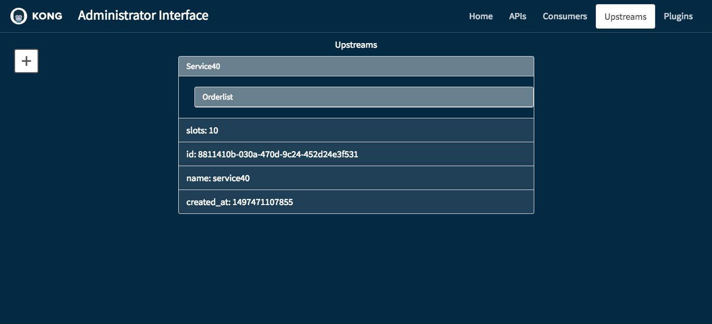

# MashapeAdminGUI

[Link to Kon's Kong Admin GUI](https://ksavransky.github.io/MashapeAdminGUI)

## Instructions For Use

- Run Kong on your http://localhost:8001/
- Then launch the site linked above.
- NOTE: if your browser is set to block mixed-content, the site may not function properly! Please set your browser to allow mixed content. For example, in Chrome, click on the shield in the url bar and allow Chrome to load unsafe scripts.

## About

This Kong Administrator Interface was developed using React, Javascript (ES6), BootStrap, jQuery, and AJAX. The product is still under development. Please enjoy!

## Views

